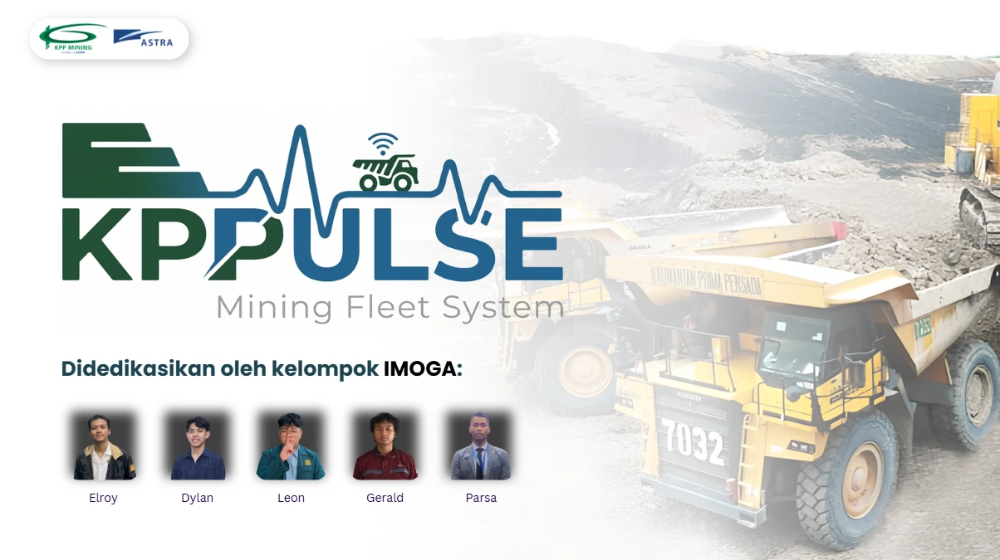

# KPPulse

Fleet intelligence for mining haul trucks. KPPulse turns raw fleet data into decisions about tire life, payload, and safe driving speed, and expresses every result in Rupiah.

Built for the Astranauts hackathon, covering two KPP Mining cases in one full-stack platform.

<!--  -->

**Pitch deck:** [KPPulse-Pitch-Deck.pdf](docs/KPPulse-Pitch-Deck.pdf) &nbsp;·&nbsp; **Live demo:** [add link here](#) &nbsp;·&nbsp; **Demo login:** admin `kpp` / `muatcerdas`, driver `budi` / `budi123`

## The problem

Mining contractors already collect data on tires, payloads, and haul routes, but that data rarely drives daily decisions. Tires wear out early, dump trucks leave the pit overloaded or underloaded, and drivers speed up to hit production targets at the cost of tire damage. Each issue is expensive on its own, and they make each other worse.

## What it does

| Module | Focus |
| --- | --- |
| **A. Tire Life Intelligence** | Predicts remaining tire life for haul trucks (Scania P410, R580, 620 XT and Volvo FH16) on the 35 km laterite route from CPP KM 33 to the jetty. Explains what is driving wear and recommends actions with estimated savings. |
| **B. Payload Optimization** | Tracks HD785 dump truck payloads against the 91 t target, flags overloading and underloading, monitors scale calibration drift, and gives loader operators green, yellow, or red guidance. |
| **C. Speed Optimization** | Connects A and B. Calculates each truck's maximum safe speed using the industry TKPH standard, compares it with the speed needed to hit the daily production target, and lays out concrete options when the two conflict. |
| **D. Roles and Road Map** | Admin and driver roles, a driver dashboard readable at a glance, and a road condition map prototype that feeds directly into tire wear predictions. |

The core platform adds CSV/XLSX data import, a financial engine (avoided cost, payback period, ROI), and downloadable PDF/CSV reports.

### Design decisions

- **Explainable over black box.** Tire life uses linear regression with visible coefficients and confidence intervals. Speed limits come from deterministic TKPH calculations. Every number on screen can be traced back to its formula.
- **One source of truth.** All domain logic lives in a shared package used by both the server and the client, so the dashboard and the API can never disagree.
- **Conservative by default.** Payload levers in the ROI model start at zero, so projected savings are never inflated before real data is loaded.
- **Ready for real data.** Swap the sample dataset for real CSV/XLSX exports from the import screen, with no code changes.

## Screens

| Screen | What you see |
| --- | --- |
| Dashboard | Combined KPIs: avoided cost, savings, payback, ROI, plus report export |
| Tire Prediction | Remaining life per unit with confidence intervals, wear attribution, model coefficients |
| Tire Recommendations | Prioritized actions (rotate, replace, adjust pressure, avoid segment) with savings |
| Payload Analytics | Distribution against the 91 t target, trends by unit and operator, overload to wear link |
| Loading Guidance | Pass and band policy generator with a bucket simulator |
| Calibration Health | Scale drift status for each HD785 |
| Speed Optimization | Safe speed per unit, required speed for the target, SAFE or CONFLICT status with options |
| Finance and ROI | Editable assumptions with live results and fleet scenarios |
| Data Import | Upload per entity with row-level validation |
| Road Map | Route segments colored by condition, adjustable condition scores |
| Driver Dashboard | Max safe speed, load, unit health, and production target for one truck |

The app UI is in Bahasa Indonesia.

## Tech stack

TypeScript end to end, organized as npm workspaces.

- **Client:** React, Vite, Tailwind CSS, Recharts, TanStack Query
- **Server:** Fastify, Prisma, SQLite
- **Shared:** Zod schemas, pure domain logic, Vitest
- **Deployment:** Docker, Render

```
kppulse/
├─ shared/src/
│  ├─ tire/       prediction, wear attribution, tire finance
│  ├─ payload/    analytics, wear link, guidance, calibration, policy
│  ├─ finance/    ROI
│  └─ speed/      TKPH, production speed, decision logic
├─ server/src/    routes, services, seed, Prisma schema
└─ client/src/    pages, API hooks, components
```

## Getting started

Requires Node 18 or newer.

```bash
npm install          # installs all three workspaces
npm run db:setup     # migrate, generate client, seed sample data (30 haul trucks, 12 HD785)
npm run dev          # server on :3001, client on :5173
```

Create `server/.env` with at least:

```
DATABASE_URL="file:./dev.db"
```

Then open http://localhost:5173.

Other commands:

```bash
npm run test         # full test suite across all workspaces
npm run typecheck    # strict TypeScript check
npm run build        # production build
```

## Deployment

The included `Dockerfile` builds a single service that serves both the API and the client.

1. Sign in to [Render](https://render.com) with GitHub.
2. Choose **New > Blueprint** and select this repository. Render reads `render.yaml` and builds the image.
3. Wait 3 to 5 minutes for the build, then open the generated URL.

On the free tier the SQLite database resets on every restart and the instance sleeps after about 15 minutes of inactivity, so the first request afterward takes around a minute. This is fine for demos. Any Docker host that sets a `PORT` environment variable (Fly.io, Railway) also works.

## Using real data

Open **Data Import**, pick an entity, and upload a `.csv` or `.xlsx` file. Invalid rows are reported individually while valid rows are saved, and re-importing a row with the same `id` updates it. Sample files, including an intentionally invalid one, are in `server/sample-data/`.

| Entity | Columns (optional in brackets) |
| --- | --- |
| `units` | id, category (`haul_truck` or `pit_dumper`), model, tareKg, ratedPayloadKg, tiresCount, [tireModel], [tirePriceIdr], [kmPerYear] |
| `operators` | id, name, shift (`day` or `night`) |
| `segments` | id, name, surface (`laterite`, `rock`, `sealed`), lengthKm, conditionScore (0 to 1), avgSpeedLoadedKmh, avgSpeedEmptyKmh |
| `tires` | id, unitId, position, installDate, [removalDate], [kmAtRemoval], [avgPressureDeviationPct], [loadIndex], removalReason (`worn`, `cut`, `overload`, `scheduled`), costIdr |
| `payload` | id, unitId, operatorId, timestamp, measuredPayloadKg, targetPayloadKg |
| `calibration` | id, unitId, lastCalibrationDate, scaleStudyOffsetPct |

Financial assumptions and TKPH parameters are edited directly in the app and stored in the database, each with a reset to default option.

## Authentication

Authentication is off by default so the demo runs without a login. Set `AUTH_ENABLED=true` and `AUTH_SECRET` in `server/.env` to turn it on. Requests then need a JWT bearer token (valid for 12 hours).

- **Admin:** full access to every module, finance, import, and the road map.
- **Driver:** only the driver dashboard for their assigned unit.

Seeded demo accounts: admin `kpp` / `muatcerdas`, drivers `andi` / `andi123` (HD-01) and `budi` / `budi123` (HT-01).

## Limitations

- Road condition data is simulated to represent LIDAR mapping. There is no live sensor feed yet.
- TKPH catalog values per tire model are placeholders and should be replaced with manufacturer data.
- Live integration with telematics, payload monitoring, or fleet management systems is planned. The architecture already separates these integration boundaries.
- Some inputs, such as current tire mileage and excavator specs, are heuristics until verified against real KPP data. All assumptions are listed in `docs/ASSUMPTIONS.md`.

## Documentation

| File | Contents |
| --- | --- |
| `docs/KPPulse-Pitch-Deck.pdf` | Pitch deck: business case, solution, impact, and ROI |
| `docs/PRD.md` | User stories, requirements, models and formulas |
| `docs/TECH_DESIGN.md` | Architecture and integration boundaries |
| `docs/MODULE_C_SPEED.md` | Speed optimization specification |
| `docs/MODULE_D_DRIVER_AND_MAPPING.md` | Roles, driver dashboard, road mapping |
| `docs/ASSUMPTIONS.md` | Assumptions that need real data, by priority |

## Team

Built by team **IMOGA** (Elroy, [Dylan](https://github.com/dylanmorenow), Leon, Gerald, and Parsa) for the Astranauts Business Challenge, KPP Mining case.
